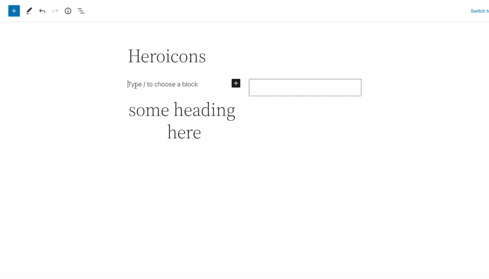
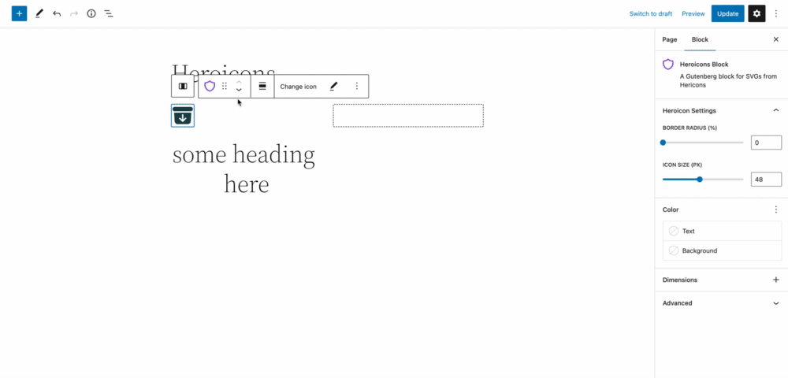
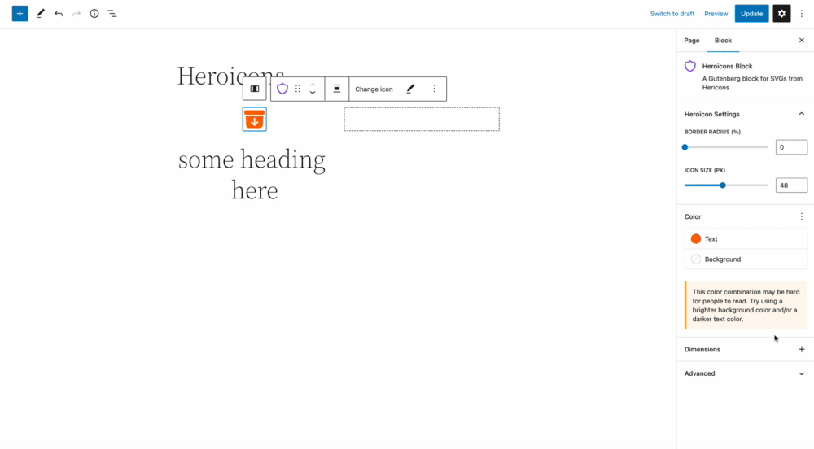
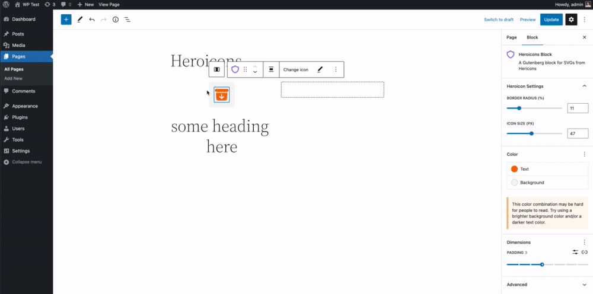

# Heroicons for Gutenberg

Select a Heroicons SVG right in the block editor.

Based on [Heroicons](https://github.com/tailwindlabs/heroicons) version 2.0.13, this block provides options to use the Solid or Outline variants of these SVG icons. In addition, you can change the size, colour, and add a background colour along with padding and border radius around the icon.

Shout out to [Joey Faruggio](https://github.com/joseph-farruggio) for the inspiration  and collaboration.

## Installation

Download the zip file, and upload it into your WordPress plugins. Activate the plugin, and the block should be made available to use.

## Block Settings

- Size
- Padding
- Border Radius
- Colour
- Background Colour
- Alignment

### Change icon colour

### Add padding around icon

### Change icon size and border radius

### Select different icon

